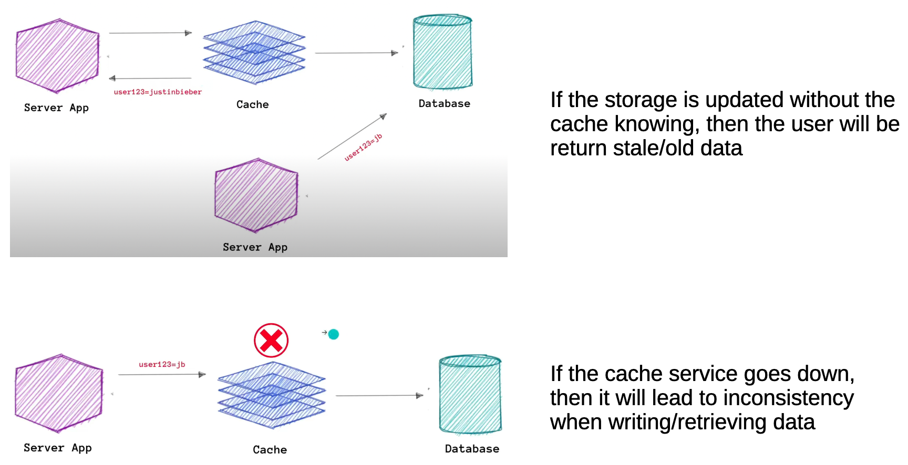

# System Design Fundamentals - Caching

## These notes will focus on application level caching.
1. **Why use cache**: 
    - **Better Scalability**: Less server load for frequently requested data
    - **Improved Response Time**: Cached responses are served much faster than making new API calls
    - **Cost Efficiency**: Reduced number of API calls can lead to lower costs

    

## Write around cache

1: The client first checks the cache for the requested data; if available, it returns the data.

2: If the data is not in the cache, the client queries the database to retrieve the data.

3: When the client writes data to the database, it simultaneously writes the data to the cache to keep it updated.

This is known as a reactive approach

### Disadvantages of Write Around Cache

## Write through cache

1) Client makes a request to the cache. If the data isn’t available, the client will write the data to the storage

2) The storage will then write this data to the cache, on every request, then return the date to the client

## Write back cache

1) When data is written to the cache, it is not immediately written to the database.

2) The data is stored in the cache and the write operation is considered complete from the application's perspective.
3) Asynchronously, in the background, the data is eventually written to the database after some delay or at a scheduled time. This approach improves performance by allowing faster write operations since the database is not immediately updated, but it ***requires a mechanism to ensure the data eventually gets written to the database***.

## When to not use cache

1) No difference in performance - sometimes adding a cache layer makes no difference to performance.

2) High randomness of requests – Caching wouldn’t be used to store comments on a live stream. Livestreams will have many random comments. It wouldn’t make sense to cache comments for the live streamer to reply to or interact with as caching every comment will take up a lot of caching storage

3) Frequently updated – Storing comments on a live stream will take up to make cache storage.

Reference: https://www.youtube.com/watch?v=bP4BeUjNkXc&list=LL&index=2&t=198s